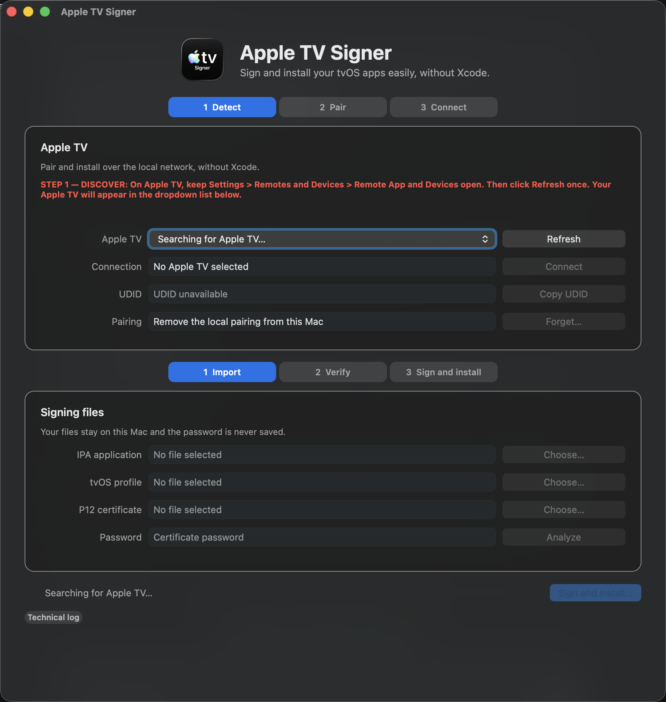
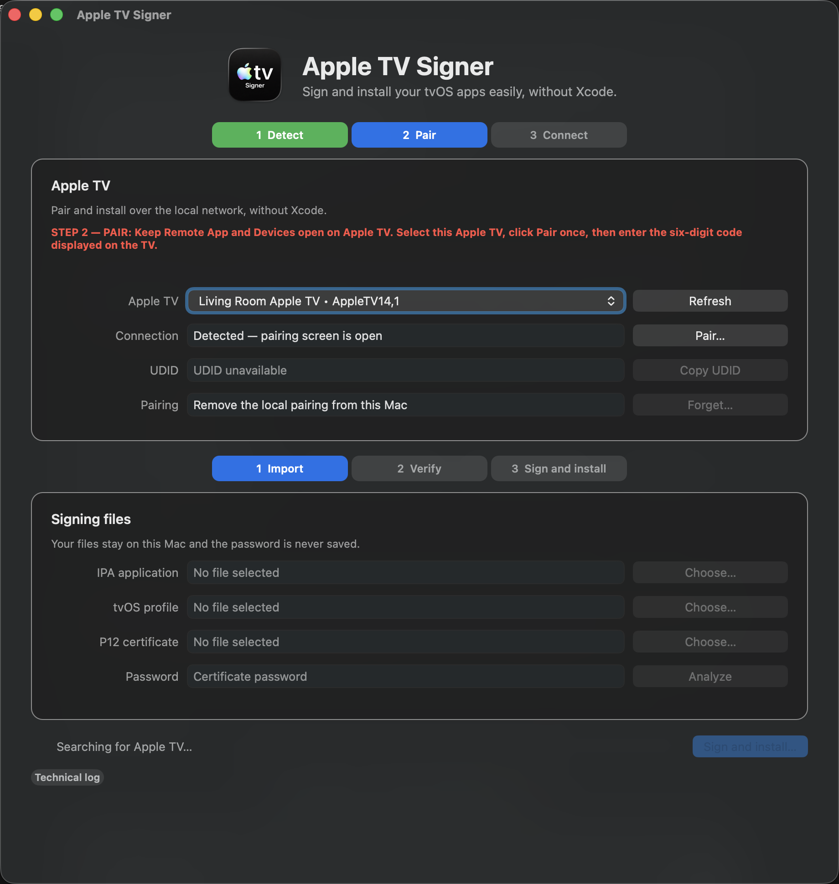
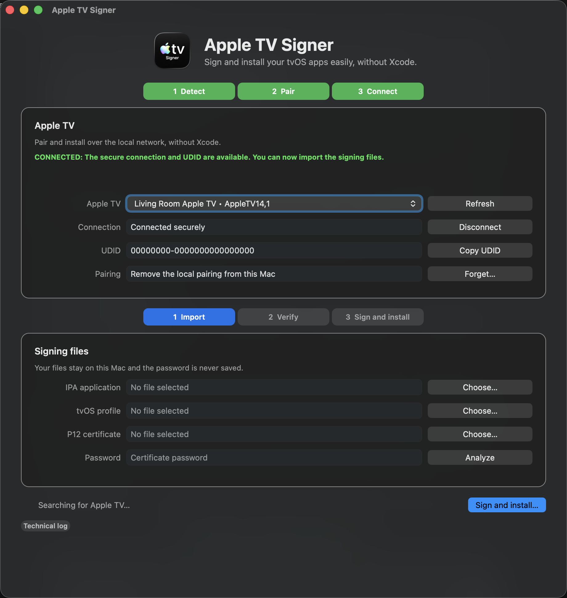
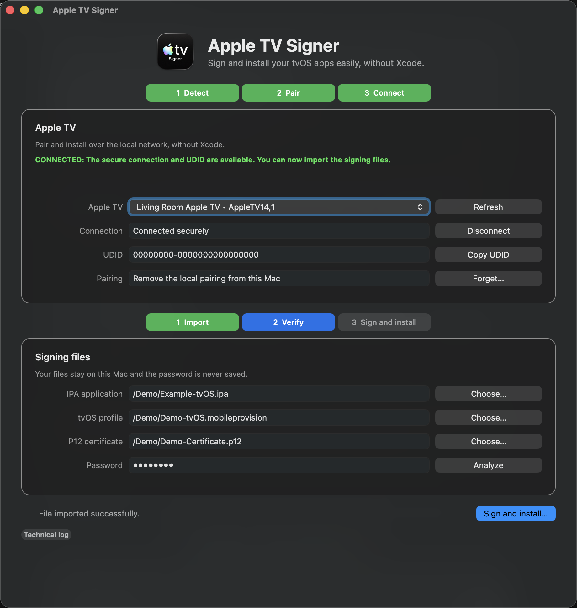
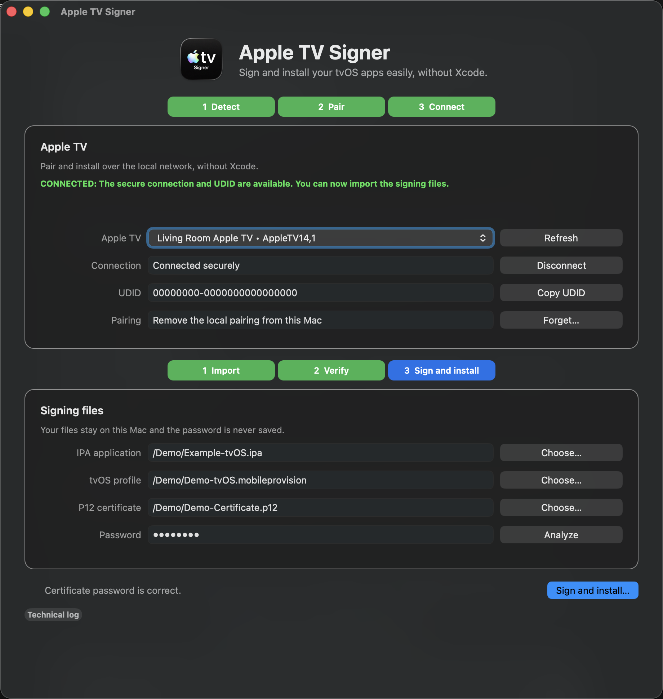
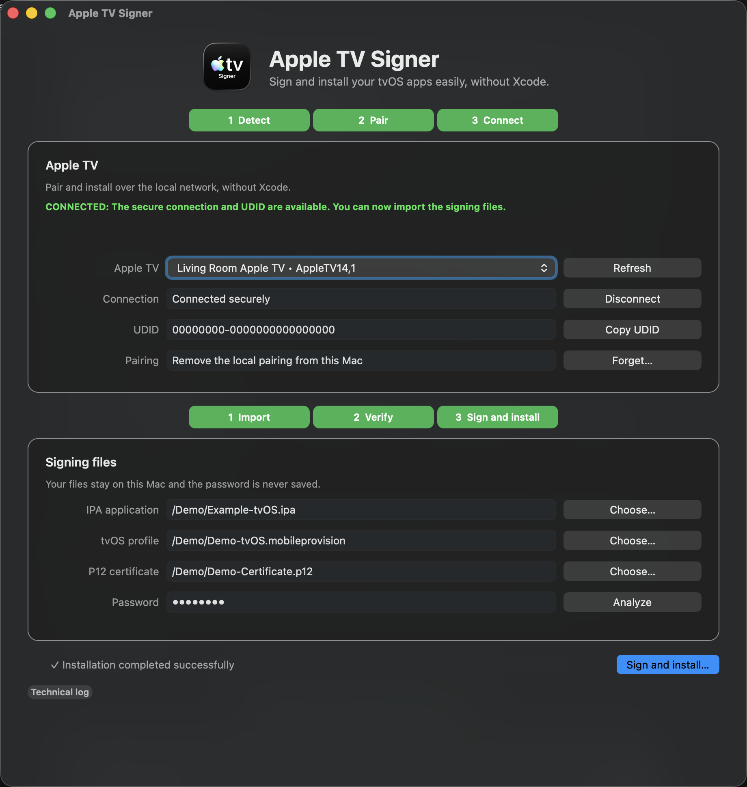
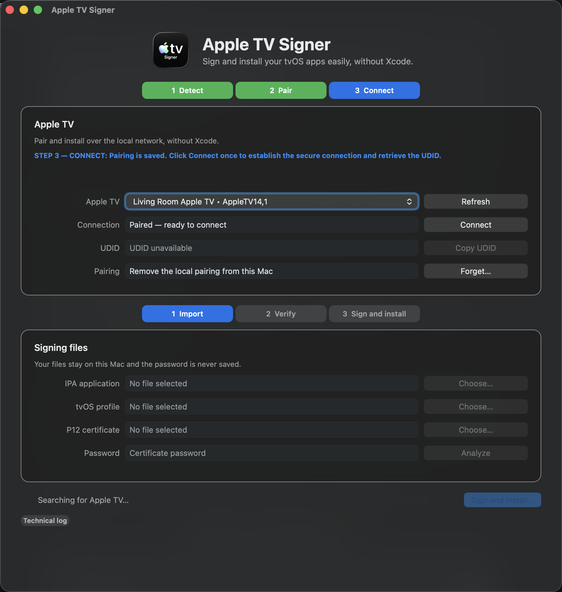
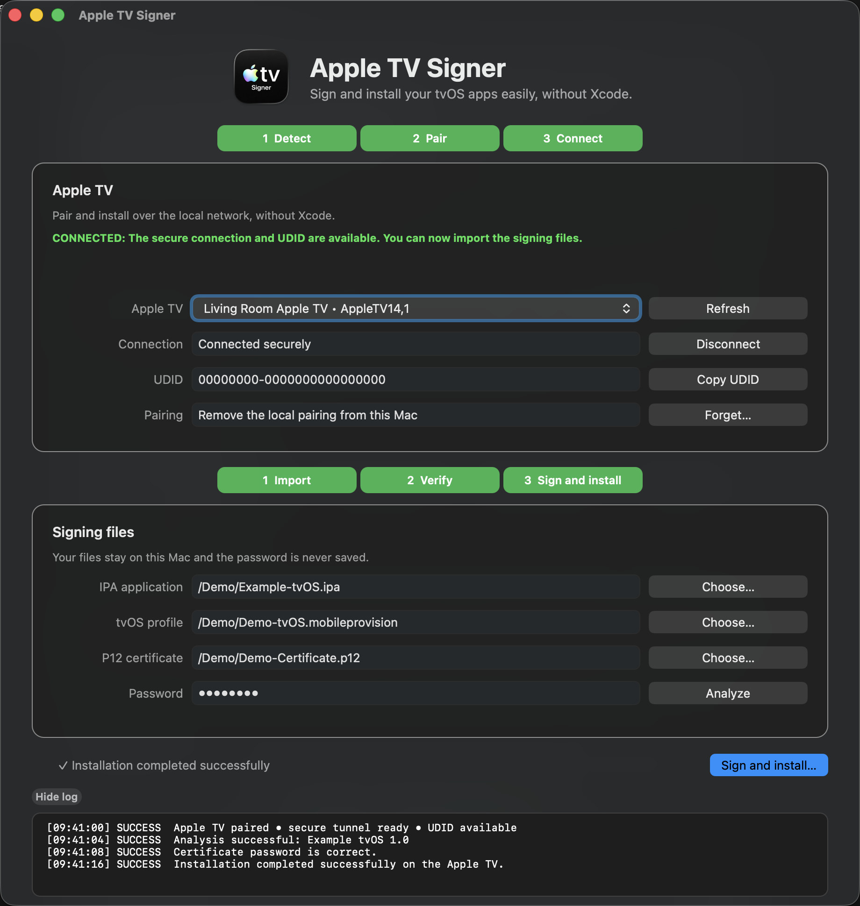
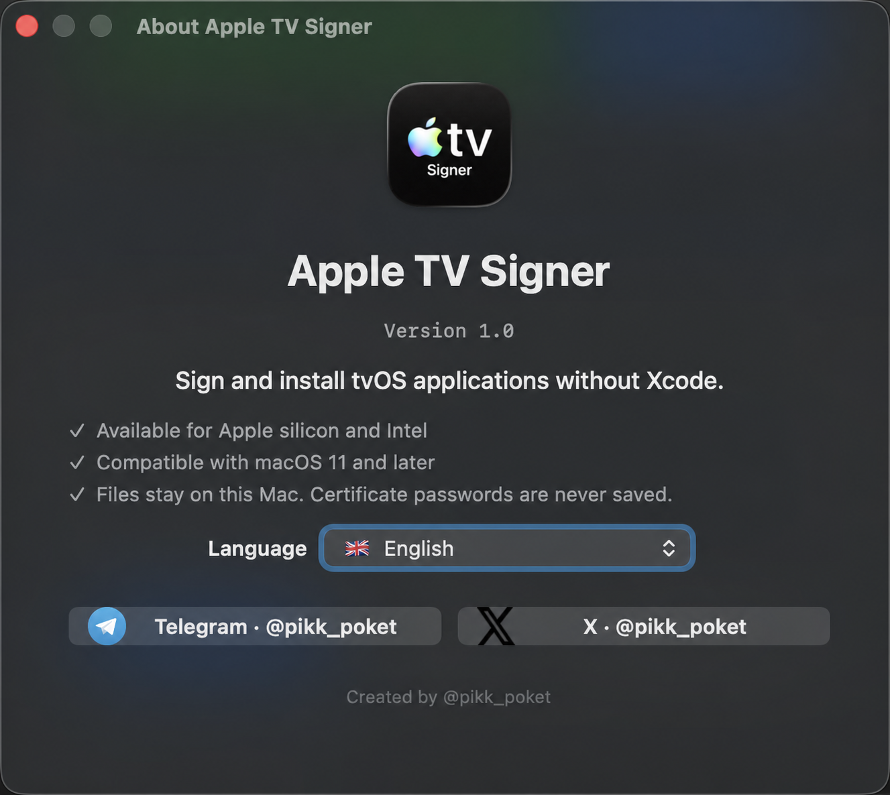

# Apple TV Signer for macOS

A standalone macOS application for pairing an Apple TV, retrieving its authenticated developer UDID, signing a tvOS IPA with user-provided credentials, and installing it over the local network.

No Xcode project, external Python installation, administrator account, or remote signing service is required on the user's Mac.

> Apple TV Signer does not include certificates, provisioning profiles, passwords, commercial applications, or Apple Developer access. Only sign and install applications you are authorized to use.

## Highlights

- Separate native builds for Apple Silicon and Intel Macs.
- macOS 11.0 or later.
- Local Apple TV discovery and six-digit pairing.
- Authenticated Apple TV UDID retrieval.
- tvOS IPA and provisioning-profile inspection.
- Original App ID displayed before signing.
- Optional App ID replacement.
- Embedded tvOS extensions are preserved and resigned.
- Temporary isolated Keychain for P12 import.
- Secure tunnel and InstallationProxy installation.
- No administrator privileges required.
- No certificate or password upload.
- Eleven interface languages.

## Screenshots

  
  

  
  

  
  

View the complete macOS walkthrough

| Discovery | Ready to pair | Pairing saved |
| --- | --- | --- |
|  |  |  |

| Connected | Files selected | Inputs verified |
| --- | --- | --- |
|  |  |  |

| Installed | Technical log | About and language |
| --- | --- | --- |
|  |  |  |

All screenshots use deterministic demonstration data. No real certificate, UDID, password, or user file is shown.

## Requirements

- macOS 11.0 or later.
- Apple Silicon ARM64 or Intel x86_64 Mac.
- Apple TV reachable on the same local network.
- A tvOS IPA you are authorized to install.
- A tvOS provisioning profile containing the Apple TV UDID.
- The matching P12 certificate and password.

## Availability

Download the archive that matches your Mac from the latest release:

- [Apple Silicon — ARM64](https://github.com/pikk-poket/Apple-TV-Signer/releases/download/v1.0.0/Apple-TV-Signer-macOS-1.0-ARM64.zip)
- [Intel — x86_64](https://github.com/pikk-poket/Apple-TV-Signer/releases/download/v1.0.0/Apple-TV-Signer-macOS-1.0-Intel-x86_64.zip)

These are separate native builds rather than a single Universal 2 binary. No certificate, provisioning profile, password, commercial tvOS application, or private project source code is included.

## How to use

1. Put the Mac and Apple TV on the same local network.
2. On Apple TV, open **Settings → Remotes and Devices → Remote App and Devices**.
3. In Apple TV Signer, refresh the device list and select the intended Apple TV.
4. Start pairing and enter the six-digit code shown by tvOS.
5. Connect the secure tunnel and wait for the developer UDID.
6. Select the tvOS IPA, tvOS provisioning profile, matching P12, and P12 password.
7. Analyze the inputs.
8. Keep the original App ID or enter an optional replacement.
9. Sign and install the application.

Keep the Mac and Apple TV on the same network until installation finishes.

tvOS does not expose an iOS-style Developer Mode switch. The **Remote App and Devices** screen makes the manual pairing service available.

## App ID behavior

The original identifier from the imported IPA is displayed during analysis.

- Leave **New App ID (optional)** empty to preserve every original identifier.
- Enter a valid explicit identifier to rewrite the main bundle and compatible embedded-extension prefixes.

Frameworks and dynamic libraries are signed first, embedded tvOS extensions such as Top Shelf are signed next, and the main application is signed last. Unsupported nested applications are rejected instead of silently removed.

The selected provisioning profile must authorize the final App ID. Updating an existing installation also requires a compatible team and application identifier.

## Signing and privacy

Apple TV Signer performs signing locally:

1. The provisioning profile is decoded and inspected.
2. A temporary Keychain is created.
3. The P12 is imported into that temporary Keychain.
4. The compatible signing identity and entitlements are selected.
5. The IPA is signed recursively.
6. The temporary Keychain and working files are deleted.

Additional guarantees:

- The P12 password is not stored.
- Original IPA, profile, and P12 files are never deleted.
- Temporary signed IPAs are removed after success or failure.
- Abandoned temporary data is purged on the next launch.
- Pairing records stay on the Mac until **Forget** is selected.
- No certificate, profile, password, or IPA is sent to a server.

## Pairing controls

- **Pair:** establishes the local cryptographic relationship.
- **Connect:** opens the authenticated device tunnel and retrieves the UDID.
- **Disconnect:** closes the current connection without deleting pairing keys.
- **Forget:** removes the local pairing keys after confirmation.

To remove the Mac on the Apple TV side as well, forget it from the Apple TV's **Remote App and Devices** screen.

## Technology overview

The native user interface is written in Swift with AppKit. Device inspection, pairing, signing, tunnel management, and installation are handled by a self-contained Python backend bundled separately for ARM64 and x86_64.

The release provides matching architecture-specific archives:

| Release | Native interface | Embedded backend |
| --- | --- | --- |
| Apple Silicon | ARM64 Swift/AppKit | ARM64 standalone backend |
| Intel | x86_64 Swift/AppKit | x86_64 standalone backend |

The backend uses standard macOS signing tools and Apple device protocols. End users do not need to install Python or Xcode.

## Languages

English, French, German, Spanish, Italian, Brazilian Portuguese, Simplified Chinese, Japanese, Korean, Arabic, and Hindi.

## Troubleshooting

- **Apple TV not found:** confirm both devices are on the same network and keep *Remote App and Devices* open.
- **Pairing unavailable:** refresh after opening the required Apple TV settings screen.
- **Pairing code rejected:** restart pairing and enter the exact six digits shown by tvOS.
- **No UDID:** connect after pairing; the Bonjour identifier is not a developer UDID.
- **Profile rejected:** verify tvOS platform, expiration, final App ID, and Apple TV UDID.
- **P12 rejected:** verify the password and certificate/profile relationship.
- **Update rejected:** the installed app may use a different team or application identifier.
- **App blocked by macOS:** use the explicit Gatekeeper approval flow for this non-notarized release.
- **Wrong architecture:** download ARM64 for Apple Silicon or x86_64 for Intel.

## Compatibility

The deployment target is macOS 11.0. The complete pairing, UDID, signing, tunnel, and installation workflow was validated during development on current macOS and tvOS hardware. Older macOS versions permitted by the deployment target should be qualified on real hardware before being treated as fully tested.

## Social links

- [X — @pikk_poket](https://x.com/pikk_poket)
- [Telegram — @pikk_poket](https://t.me/pikk_poket)

## Disclaimer

This project is not affiliated with or endorsed by Apple. Apple TV, macOS, tvOS, and Xcode are trademarks of Apple Inc. Users are responsible for complying with Apple Developer terms, local law, and the licenses of the applications they sign.
